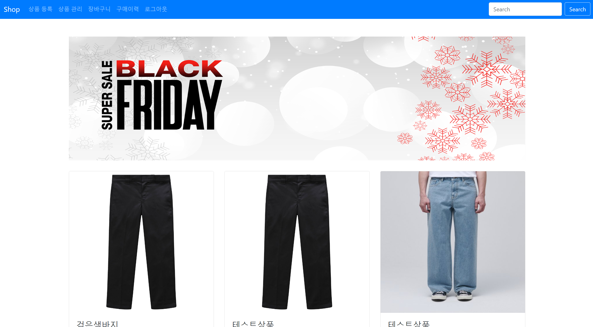

# 쇼핑몰 프로젝트

## 개요
Spring Boot를 활용한 쇼핑몰 프로젝트 제작

## 주요 기능
- **회원 관리**: 회원 가입, 로그인, 로그아웃
- **상품 관리**: 상품 등록, 수정, 삭제
- **장바구니**: 상품을 장바구니에 담기, 장바구니 목록 보기, 장바구니에서 상품 삭제
- **주문**: 상품 주문하기, 주문 내역 보기
- **관리자 기능**: 상품 관리, 주문 관리

## 기술 스택
- **백엔드**: Spring Boot, Spring Data JPA, Hibernate
- **프론트엔드**: Thymeleaf, HTML, CSS, JavaScript, JQuery
- **데이터베이스**: MySQL
- **빌드 도구**: Gradle

## 설치 및 실행 방법

### 필수 조건
- Java 11 이상
- Gradle
- MySQL

MySQL에서 데이터베이스를 생성하고, src/main/resources/application.properties 파일에 데이터베이스 연결 설정을 업데이트합니다.

spring.datasource.url=jdbc:mysql://localhost:3306/shop?useSSL=false&serverTimezone=UTC

spring.datasource.username=yourusername

spring.datasource.password=yourpassword

spring.jpa.hibernate.ddl-auto=update

## 사용 방법
- **회원 가입 및 로그인**:
  
1. 홈페이지 상단의 "회원가입" 버튼을 클릭하여 회원 가입을 완료합니다.
2. "로그인" 버튼을 클릭하여 로그인합니다.
- **상품 검색 및 장바구니**
  
1. 홈페이지에서 상품을 검색할 수 있습니다.
2. 상품을 클릭하여 상세 페이지로 이동한 후 "장바구니에 담기" 버튼을 클릭합니다.
3. "장바구니" 페이지에서 장바구니에 담긴 상품을 확인하고, 수량을 변경하거나 삭제할 수 있습니다.
 
- **주문하기**
  
1. 장바구니 페이지에서 "주문하기" 버튼을 클릭하여 주문을 완료합니다.
2. "주문 내역" 페이지에서 주문한 내역을 확인할 수 있습니다.

- **관리자 기능**

1. 관리자 계정으로 로그인하여 상품을 등록, 수정, 삭제할 수 있습니다.
2. "관리자 페이지"에서 주문 내역을 관리할 수 있습니다.

## 스크린샷
- **로그인 화면**

- **메인 화면**

- **상품 목록**

- **상품 등록**

- **장바구니**

- **상세 페이지**

- **구매 이력**

- **상품 주문**

